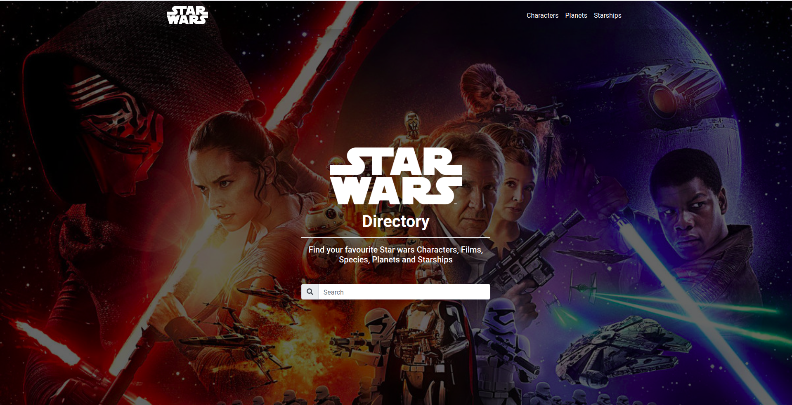

# Star Wars Application

[Star Wars](https://en.wikipedia.org/wiki/Star_Wars) application is a web directory of Star wars resources fetched from the [SWAPI Star Wars API](https://swapi.dev/).

# Table of Contents

- [Getting Started](#Getting-Started "Goto Getting-Started")
- [Technology Stack](#Technology-Stack "Goto Technology-Stack")
- [Installation](#Installation "Goto Installation")

## Getting Started

This is a frontend javascript application built with [React JS](https://reactjs.org/).

## Technology Stack

- ReactJS
- Redux
- Bootstrap

## Installation

1. Install [Node JS](https://nodejs.org) on your machine.

2. Clone the repository.

3. Change directory into the root of the project directory.

4. Run `npm install` on the terminal to install project dependecies.

5. Start the application: Different Build Environments.

- ### Production

`npm run build`

- ### Development

`npm start`
